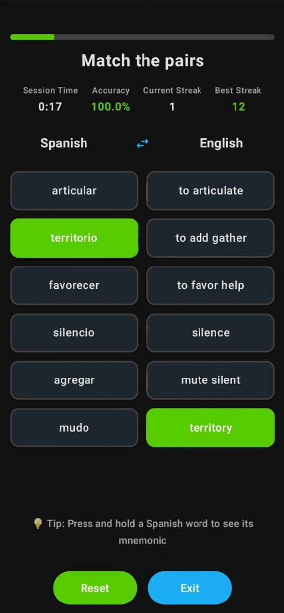

# Spanish Words

An Android app to help you learn Spanish vocabulary through interactive matching game.

## What is Spanish Words?

Spanish Words is a vocabulary learning app that helps you memorize Spanish words by matching them with their English translations. The app includes 5,000 word pairs with helpful memory aids called mnemonics.

## Features

- **Matching Game**: Match English words with their Spanish translations
- **Memory Aids**: Long-press Spanish words to see mnemonics that help you remember them
- **Large Vocabulary**: 5,000 English-Spanish word pairs to learn from
- **Swappable Layout**: Switch between Spanish-English and English-Spanish matching
- **Progress Tracking**: The app remembers which words you've already practiced

## How to Use

1. **Start the Game**: Open the app and you'll see columns of English and Spanish words
2. **Make Matches**: Tap on an English word, then tap on its Spanish translation to match them
3. **Get Hints**: Press and hold any Spanish word to see a mnemonic that helps you remember it
4. **Switch Sides**: Use the swap button to practice matching in different directions
5. **Reset**: Use the reset button to start with new words

## Download

Download the latest version of the app from the [Releases](https://github.com/roundyyy/Spanish_Words_Game/releases/tag/0.1) page.

## Requirements

- Android 7.0 (API level 24) or higher
- 50 MB of free storage space

## Learning Tips

- Use the mnemonics to create mental associations between words
- Practice regularly for better retention
- Try both matching directions (English to Spanish and Spanish to English)
- Don't worry about making mistakes - they help you learn

## Contact

For questions or suggestions about the app, please open an issue on this repository. 
